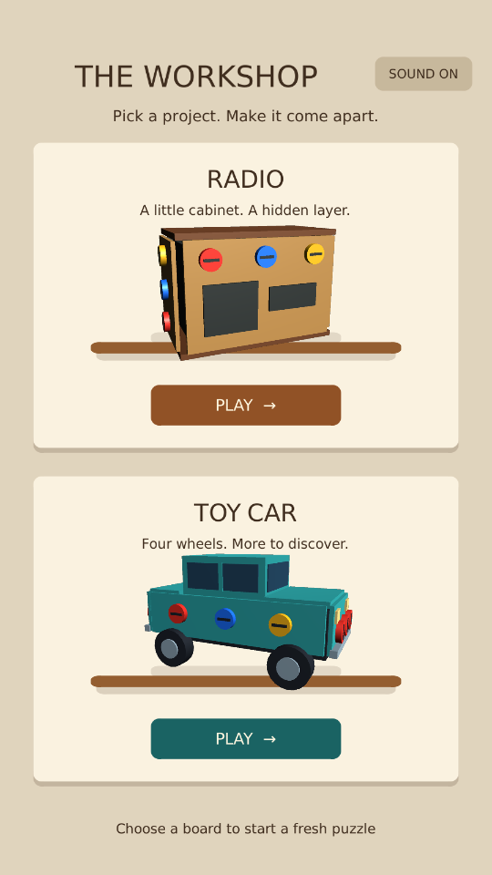
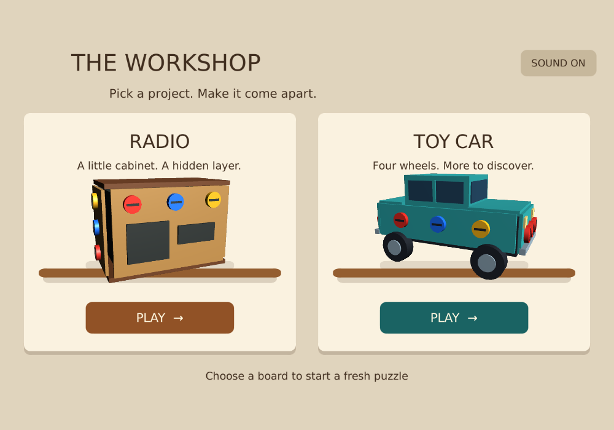
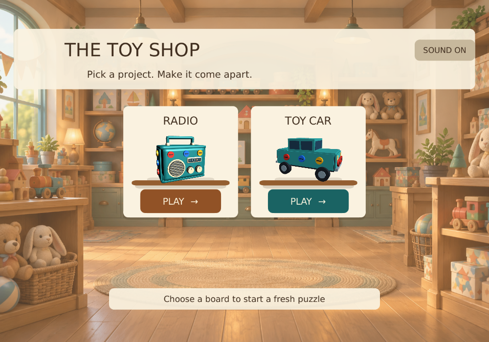
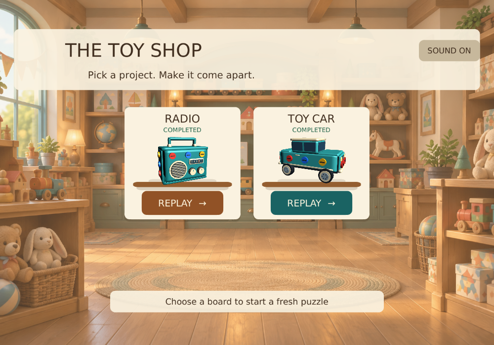

# 3D Workshop board selection

Status: implemented and accepted. On 2026-10-01, the user reported all test scenarios
passed after the final toy-radio art pass. Validation notes below preserve the
checks and pending items recorded during each earlier iteration.
The tested two-board milestone was saved to GitHub as 52fc53b before this change.

## Open on PC

Use **Tools → ScrewPuzzle → Open 3D Workshop**, then Play.
Choose Radio or Toy Car. Each board has 15 screws, five plates and two free trays.
BOARDS returns to selection from either board, including during animation or after a win.
Escape / Android Back on a board does the same. Choosing a board starts a fresh run:
removed screws, plate state and temporary bonus unlocks are reset. Sound preference persists.

## One Android app

Switch to Android in Build Profiles, then use
**Tools → ScrewPuzzle → Build 3D Workshop Android Test**.
The resulting APK starts at the selector and includes both boards. It uses the separate
.workshop3dtest application ID and does not replace the normal game or earlier test apps.
The command restores the original app ID, product name and APK/AAB choice afterward.
The main game's build scene list is not modified. No APK has been built by the agent.

The earlier Radio and Toy Car build commands still start at their respective boards,
but now also include the selector and the other board so BOARDS works in those APKs.

## Acceptance checks

1. Open the Workshop, choose Radio, and check the correct title and radio model.
2. Press BOARDS during a screw animation. Choose Toy Car and confirm a fresh car puzzle.
3. Unlock a bonus tray, collect a screw, return to selection, and reopen that board.
   All 15 screws and five plates must be restored; bonus trays must be locked again.
4. Complete either board, return with BOARDS, then play the other board.
5. Toggle sound off, switch boards several times, and confirm it stays off. Toggle it
   back on and verify sound on both boards. There should be no overlapping old audio.
6. Use Escape on PC or Android Back on a board to return to selection.
7. Check portrait and wide layouts; selector cards and both bottom buttons must fit.
8. Build the combined Android APK and repeat the board-switching and completion checks.

## Implementation

ThreeDBoardNavigation provides scene paths and the shared test-build scene lists.
The Editor can open experiment scenes in Play mode without adding them to the normal
build list; Android uses the scenes included by the dedicated test builder.
ThreeDBoardSelectBootstrap builds the responsive, safe-area-aware selection UI.
Single-scene loading disposes the previous model, animation, and scene-owned sound.

## Validation

All 21 automated Unity tests passed, including the new scene-list and board-switching regressions. The navigation test leaves during screw motion, switches both boards, verifies fresh state and preserved sound, and checks for duplicate cameras, listeners and event systems. A separate preview capture passed; portrait and wide selector layouts and the board return controls were inspected. Android building and manual PC/phone acceptance are pending.

## Workshop shelf redesign

The selector now uses warm cream cards, rounded corners, soft shadows and wooden
shelves. Transparent previews are rendered from the actual Unity board models and
loaded as textures; the menu does not create extra live cameras or puzzle instances.
Card names are larger, descriptions are shorter, and each card has a clear Play button.
The full card also opens its board. Sound sits in the top corner. Technical screw/tray
counts have been removed from this screen.

The layout changes at a width-to-height ratio of 1.1: cards are stacked below that,
and side by side above it. Both arrangements fit within the safe area. Each visit
still starts fresh; gameplay, navigation and sound preference behavior are unchanged.

Check both card bodies and Play buttons, Sound, portrait phones and a wide Free Aspect
Game view. Rebuild the Workshop APK to see the new design on the phone.

Shelf redesign validation: both navigation regression tests passed. Final portrait (540 x 960) and wide (1000 x 700) renders were inspected after correcting preview framing and texture color imports. This visual-only pass did not change gameplay. Manual PC/phone acceptance is pending. Preview textures were rendered from the project's original Unity models; no external artwork is used.

## Toy shop background

The approved follow-up adds a generated cozy toy-store interior and renames the selector THE TOY SHOP. The background fills the screen with a centered crop in both orientations. A warm translucent wash and title/footer backings preserve readability; background images do not receive input. Board cards, navigation and gameplay are unchanged. Artwork provenance and exact prompt: [Toy shop background](art/Toy_Shop_BACKGROUND_SOURCE.md). Rebuild the combined APK for phone testing.

Toy-shop validation: both navigation regression tests and the preview capture passed. Portrait and wide views were visually inspected for cropping, text readability and card contrast. Manual PC/phone acceptance remains pending.

Card-size refinement: reduced card area by roughly 35–39% in portrait and wide layouts, tightened the preview and text spacing, and retained the Play buttons' original dimensions. More of the toy-store background is visible around and between the cards.

Compact collection layout: replaced large cards with 340 x 330 tiles containing only the title, model preview, shelf and Play button. The responsive grid supports two columns in portrait and three in wide views, with vertical touch/mouse scrolling when added boards exceed the viewport. Header and footer stay fixed. No placeholder boards were added.

Compact-grid validation: both navigation regression tests and preview capture passed. The two-board portrait and wide layouts were visually inspected. Manual scrolling with a larger future catalog has not yet been device-tested.

## Saved completion (2026-10-01)

Each board saves a device-local completion flag after the final plate finishes
releasing. Completed cards show COMPLETED and REPLAY. Replay starts a fresh puzzle;
Restart and leaving a replay do not erase completion. Unfinished runs are not saved.
Records use stable radio/toy-car IDs under a separate Workshop3D PlayerPrefs namespace,
and are flushed at completion. They do not sync between PC and phone. Wins from older
versions cannot be recovered because those versions did not store completion.

Validation: seven selected tests passed (radio interaction, car completion/restart,
navigation and independent preference records), plus a portrait/wide render helper.
The car test verifies no early completion, saved completion after winning, preservation
through Restart, and the completed/replay card after returning to selection. Test-suite
setup preserves and restores existing completion preferences. Both layouts were inspected.

Device acceptance: the user reported all test scenarios successfully passed after
being asked to verify completion, closing/reopening the app, Replay and Restart on
PC and a fresh phone build. Each device tracks its own wins.

