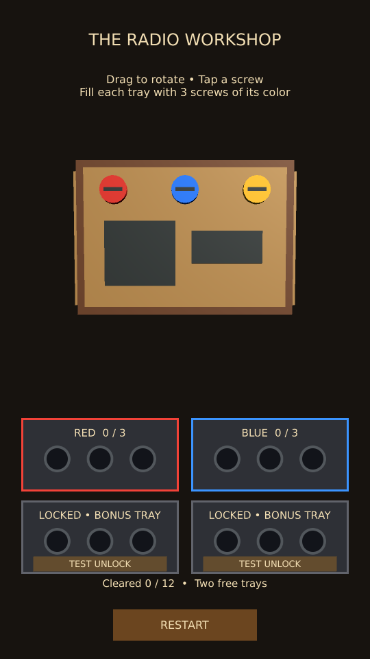
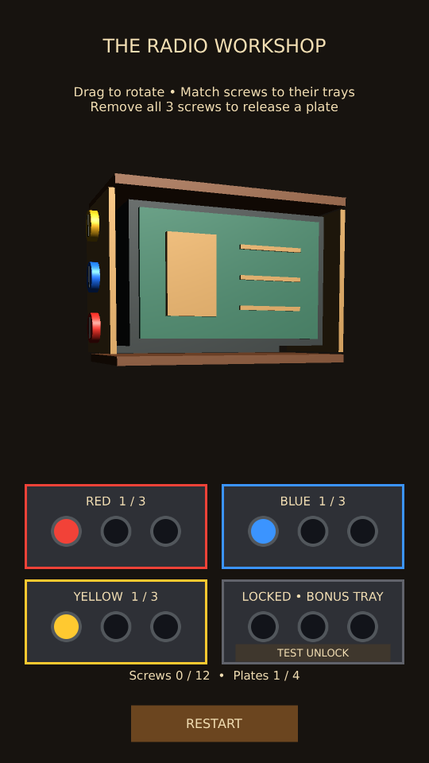
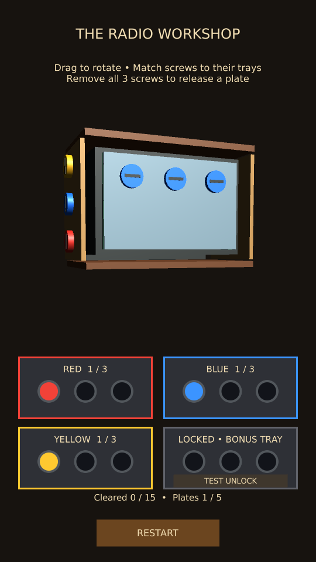

# 3D Radio color-tray experiment

Separate from the existing 2D levels and saved progression.

## Rules

Rotate the radio to reach fifteen screws: six red, six blue, and three yellow. Three blue screws sit behind the outer front plate.
Four trays contain three holes each. Red and blue trays start open; two bonus trays
start locked. Each open tray accepts only its assigned color. A complete set of three
clears and the tray receives the next pending color (yellow, red, then blue).
A screw without an available matching tray stays on the radio and displays guidance.
The board is fully solvable using only the two free trays. There is no overflow loss
in this version. Clearing all fifteen screws and releasing all five plates wins.

Bonus trays use clearly marked TEST UNLOCK buttons. These consume the next pending
color order early; they do not add duplicate orders. No ads, billing, or saved purchases
are connected. Restart relocks both bonus trays and restores all screws and rotation.
Actual rewarded-ad and purchase integration remains future work.

## Open and test

PC: Tools → ScrewPuzzle → Open 3D Radio Test, then Play. Try portrait and Free Aspect.
Android: switch Build Profiles to Android, then Tools → ScrewPuzzle → Build 3D Radio
Android Test. This builds a separate .radio3dtest application while preserving normal
build settings. A new APK must be built to test these changes on the phone.

- Confirm four trays, three holes each, two initially open and two locked.
- Tap yellow initially: it stays on the radio and guidance appears.
- Collect red from front/back/left: the red tray clears and becomes yellow.
- Collect yellow from front/back/left, then blue, then the three right-side red screws, then the three inner blue screws:
  the board completes without opening a bonus tray.
- Restart and open both test trays: yellow and a second red order become available.
  Complete all five orders; every screw should be accounted for exactly once.
- Restart during screw flight and after completion: all screws return and bonus trays relock.
- Drag away and back starting on a screw: rotation must not become a tap.
- Hidden screws remain blocked by the cabinet. Canceled/multitouch gestures do not remove screws.
- Check that tray controls do not select screws behind them and the radio remains clear of the UI.

## Implementation

Radio3DPrototypeBootstrap builds the cabinet and responsive portrait UI fitted within the
screen safe area. Trays are UI cards with circular holes, replacing oversized world-space
blocks. Radio3DPuzzle owns assigned-color orders, flight, clearing, unlock simulation,
and restart. Radio3DInteraction owns gesture handling and nearest-hit raycasts.
Radio3DScrew caches its original transform and collider state.

The previous five-slot version passed user PC/phone testing. The new four-tray version
needs a fresh visual and device check. Automated checks cover both free-only and unlocked
completion, unavailable-color rejection, color replacement, occlusion, gesture intent,
and restart during flight.

September 30, 2026: all 16 Unity EditMode tests passed in the isolated validation copy after the color-tray rewrite. Manual PC/phone verification of this new layout remains pending.
Final spacing follow-up: the interaction regression and preview capture both passed. Portrait (540 x 960) and wide (1000 x 700) renders were inspected.

User acceptance: the user confirmed that the four-tray layout looks good and all test scenarios passed. Approved saving this milestone before detachable-plate work.

## Detachable plates — next prototype pass

The approved color-tray milestone was pushed to GitHub as 4da8d47 before this work.
The new plate behavior is a separate local change, awaiting manual PC/phone validation.

Each face has its own plate and three fasteners. Removing its last screw releases only
that face. The plate moves outward, tips and drops, then disappears. Front-mounted speaker
and tuning-display decorations travel with the front plate, revealing a circuit board.
A smaller inner chassis and the top/bottom frame remain. They continue to block taps
through the radio. There are no deeper screw layers yet.

Input waits for the release animation before accepting another screw or rotation. Win
appears after all screws clear and all four plate animations finish. Restart restores
all screws, plates, colliders, decorations, trays and orientation, including during motion.
Radio3DPlate owns the readiness check and pose animation; Radio3DPuzzle runs the coroutine
so cancellation and tray resolution share one owner. Plates stay under the radio root
so resizing or safe-area changes keep their animation aligned.

### New acceptance checks

1. Open the 3D Radio Test and use TEST UNLOCK once to make yellow available.
2. Remove front red and blue: the front plate must remain attached.
3. Remove front yellow: the front plate, speaker and display fall away together;
   the circuit board appears. Other plates stay attached.
4. Rotate to each other face and remove its own three screws. Only that face releases.
5. Restart while a plate is moving: everything returns and stays restored after one second.
6. Complete the board with only the two free trays using the original safe route above.
   The win message appears after the final plate finishes, with four plates removed.
7. Verify portrait and Free Aspect layouts, then build a fresh Android test APK and repeat.

Automated validation: all 17 Unity tests passed. A separate render capture passed and the front-plate removal result was inspected at 540 x 960 and 1000 x 700. Device validation of this new behavior remains pending.

User acceptance: all detachable-plate test scenarios passed; user approved saving this milestone and starting one inner front plate.

## Inner front plate — current local prototype

The tested detachable-plate milestone was pushed as dd94404 before this change.
A smaller steel-colored plate now sits behind the brass front plate. Its three blue
screws become selectable only after the outer plate finishes releasing. Removing the
inner plate reveals the circuit board underneath. The board now has 15 screws, 5 plates,
and five three-screw orders. The extra blue order is queued after the outer orders;
both free trays are still sufficient to finish the whole board.

The inner screws have a covering-plate dependency checked by both raycast selection
and puzzle collection. Physical occlusion is retained. Restart restores both layers
and locks the inner screws again, including during either plate's release animation.
Totals in the HUD come from the configured screws and plates.

### Inner-layer acceptance checks

1. Before removing the front plate, rotate around the radio and tap around the inner
   screw positions: no inner screw should be collected through another face.
2. Use both TEST UNLOCK buttons to open the yellow and extra red trays. Remove front red, blue and yellow. Wait for
   the front plate to fall away: a smaller steel plate with three blue screws appears.
3. Collect the inner screws when a blue tray is available. The inner plate stays put
   after two screws, then falls away after the third, revealing the green circuit board.
4. Restart during either layer's motion: both plates and all 15 screws return; inner
   screws become inaccessible again and the bonus trays relock.
5. Without unlocking bonus trays, use this route: front/back/left red, front/back/left
   yellow, front/back/left blue, all right-side red, then all inner blue. The board
   must stay in play at 12 cleared screws and win only at 15 screws and 5 plates.
6. Build a fresh Android test APK and repeat the same checks on the phone.

The earlier single-layer checklists and validation records describe their respective
milestones; current win totals are 15 screws and 5 plates. New manual validation is pending.

Inner-layer validation: all 17 automated Unity tests passed, including hidden-screw rejection around the radio, two-tray completion, no premature win, and restart during both plate animations. Portrait and wide renders of the revealed inner plate were inspected. Manual PC/phone testing is pending.

User acceptance: all inner-layer scenarios passed; user approved saving the milestone and adding animation and sound polish.
