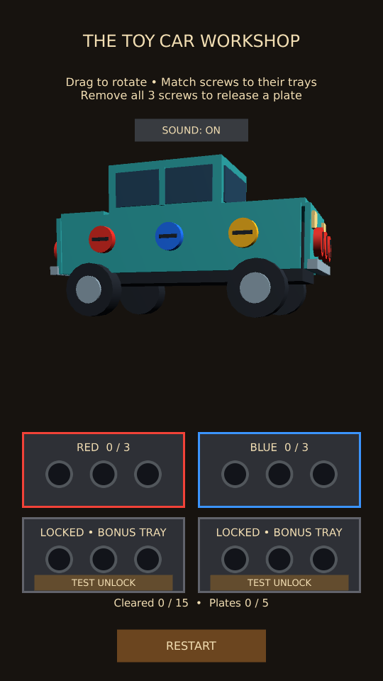
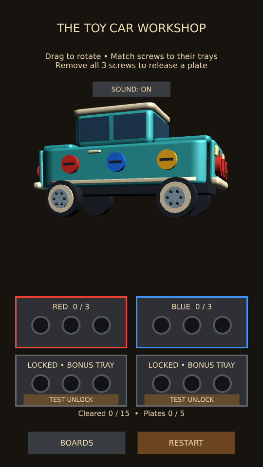

# 3D Toy Car experiment

Status: first playable prototype, manual PC/phone testing pending.

The tested radio polish milestone is saved on GitHub as e5e8ca1. This separate car scene
shares the radio's rotation, nearest-hit selection, color trays, screw animations,
layer dependencies, plate release, sound preference, and restart behavior.

## Open and build

- PC: Tools → ScrewPuzzle → Open 3D Toy Car Test, then Play.
- Phone: select Android in Build Profiles, then Tools → ScrewPuzzle → Build 3D Toy Car
  Android Test. Install the new APK. The test app uses .toycar3dtest, separate from the
  radio test and normal game; the command restores the original build settings afterward.
- Scene: Assets/Scenes/Experiment_ToyCar3D.unity. It is not in the normal game scene list.

## Board

A teal toy car with four wheels, windows, hood and trunk. Four outer removable panels
cover the two sides, nose, and rear. A smaller silver plate sits behind the initially
visible side panel; removing it exposes a motor block. Wheels and cabin remain as the
chassis. The prototype uses simple geometry, not final production artwork.

There are 15 screws: six red, six blue, three yellow. The near side, far side, and rear
have one of each color. The nose has three red; the inner side plate has three blue.
The four trays, two free and two optional test unlocks, use the same R/B/Y/R/B orders
as the radio. No real ads, billing, saved progress or board-to-board navigation is added.

## Acceptance checks

1. Rotate through a full turn on PC and phone. All four outer faces are reachable;
   dragging on a screw does not collect it, and taps through the body do not select
   hidden screws. Test portrait and wider Game views.
2. With both test trays locked, collect near/far/rear red, then near/far/rear yellow,
   then near/far/rear blue, then the three red nose screws, then the three inner blue.
   Each panel releases only after its own three screws. At 12 cleared screws the
   puzzle stays in play; at 15 screws and five panels it wins.
3. Restart and open both TEST UNLOCK trays. Collect the near side's red, blue and yellow:
   the silver inner plate appears with three blue screws. They were inaccessible before
   the outer panel finished releasing. Collect them to reveal the motor.
4. Restart during screw rotation, flight, and plate release. All panels and screws return,
   the initial car angle is restored, and bonus trays relock.
5. Check sound on/off, comfortable tap targets around the bumpers, and no UI overlap.
6. Reopen the Radio test and check its original model, layered plates and controls.

## Implementation

ToyCar3DPrototypeBootstrap overrides model construction and headings in the common
Radio3DPrototypeBootstrap. The existing Radio3D-named interaction, puzzle, screw,
plate and feedback components are shared by both scenes. The radio model itself retains
its original geometry. Both editor build commands use one helper with separate scene
paths and app identifiers. The production 2D Toy Car remains unchanged.

## Validation record

The existing 18 tests passed after sharing the board setup. The first toy-car run timed out across a long interruption; the focused rerun with larger horizontally arranged bumper screws passed. All 19 project tests have passed across these runs. The car regression covers selection on all faces, hidden inner screws, free-tray completion, no early win, and full restart. A separate render capture passed; 540 x 960 portrait and 1000 x 700 wide previews were inspected. No Android APK has been built by the agent; manual device validation is pending.

User acceptance: all test scenarios passed on both boards; user approved saving this milestone and adding a shared 3D board selector.

## Toy car visual polish (2026-10-01)

The car now has rounded teal body panels, hood, trunk and cabin, a cream roof,
cream wheel rims with hub bolts, side trim and door handles, rounded cream bumpers,
front headlights, red rear lights and small end grilles. Side trim belongs to its
side plate; lights, grilles and bumpers belong to their end plates, so decorations
move with the correct assembly during removal and return on Restart. The roof and
wheels stay on the chassis. The Toy Shop thumbnail uses the updated model.

Screw positions, colors, five plate assignments and tray rules are unchanged.
The car completion/restart regression and both navigation regressions passed.
Two render helpers also passed; portrait and wide gameplay views and the transparent
menu thumbnail were visually inspected.

User acceptance (2026-10-01): the user reported that all test scenarios passed
successfully after the toy car visual polish and the requested PC/phone checks.

