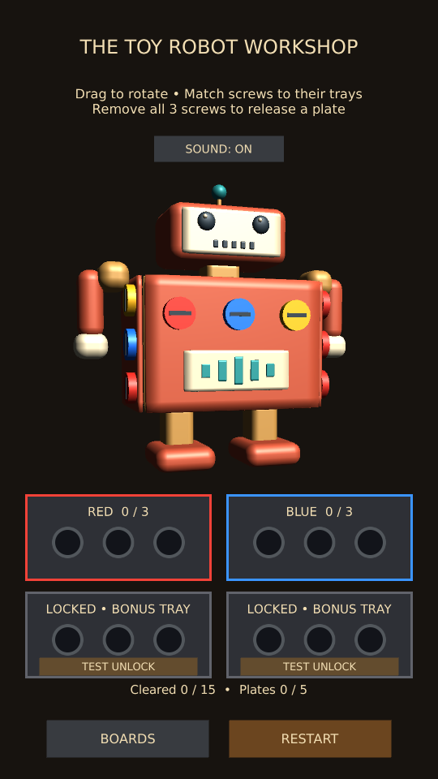

# 3D Toy Robot

Open **Tools > ScrewPuzzle > Open 3D Workshop**, press Play, then choose **Toy Robot**.
Build a fresh phone app with **Build 3D Workshop Android Test**. All experiment
builds now include the selector and all three boards. Production 2D levels remain separate.

The coral-and-cream robot has a face, antenna, arms and boots. Its chest, back,
left side, right side and inner chest are five removable plates with 15 screws.
The chest display moves with its panel. Removing the chest exposes three blue
inner screws; removing the inner plate reveals a motor with brass discs.
The head and limbs remain on the chassis. Rotate horizontally to reach every side.

The existing two free trays can clear the board. Completion is saved under its own
stable toy-robot ID. Replay starts fresh and preserves completion, as on the other boards.
The menu shows two columns on portrait phones and three on wide displays.

## Device checks

- Enter from the Toy Shop and rotate to all four sides; test taps and drags.
- Clear all 15 screws using the two free trays. Confirm the inner screws are blocked
  until the chest finishes releasing and all five panels release before winning.
- Restart during an animation and after a win; all screws and panels should return.
- Return to the Toy Shop, switch boards, and confirm sound preference is preserved.
- After winning, close/reopen the app and check COMPLETED / REPLAY for the robot.
- Repeat in the newly built Android app. Check the third card in both orientations.

Automated validation and manual acceptance are recorded with this milestone.

Validation: all 23 project tests passed, plus two render helpers (25 total). The robot test enters through its Toy Shop card, checks access from each side, hidden-layer gating, free-tray completion, five released panels, Restart, and saved completion on return. Portrait and wide previews were inspected. User acceptance (2026-10-03): the user reported all requested test scenarios passed successfully.
