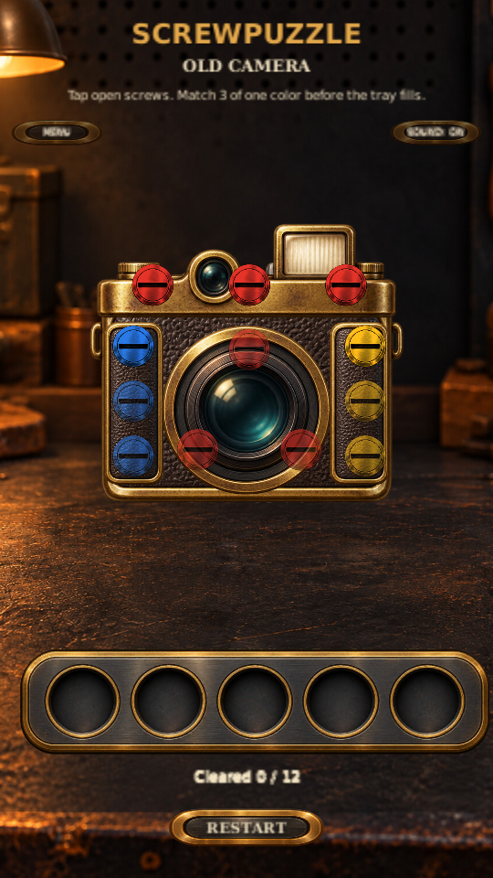

# ScrewPuzzle V0.8 — Old Camera

Status: **Complete — production artwork and all test scenarios validated on PC and physical Android phone**

## Approved milestone

Add Old Camera as Level 4 with a restoration-and-flash payoff.

## Implemented

- Twelve screws, five tray slots, match-three clearing.
- Four repair stages: flash housing, film door, grip panel, and lens assembly.
- Safe route: top red trio, blue and yellow trios in either order, then lens red trio.
- Existing menu, restart, sound, loss, and result controls.
- Toy Robot unlocks and opens Camera; Camera returns to Level Select.
- Four compact level cards using the existing workshop styling.
- Parts reseat, lens focuses, and one local flash fires before the result.
- Android version 0.8.0, version code 5.

Camera visuals now use a transparent production atlas: leather-and-brass chassis, flash housing,
two side panels, and a glass lens. Each repair assembly moves independently. Generated geometry
remains a missing-resource fallback. Background, screw hardware, tray, typography, and buttons
reuse existing assets. See [art source and prompt](art/OldCamera_ART_SOURCE.md).

## Save compatibility

Existing unlocks and preferences remain intact. V0.7 stores only the highest unlocked level,
so it cannot distinguish a finished Toy Robot from an unlocked Toy Robot. Completing or replaying
Toy Robot unlocks Camera. Camera completion caps progression at Level 4.

## Acceptance checks

Open Assets/Scenes/Level04_OldCamera.unity for direct testing.

| Test | Expected result |
|---|---|
| Open Camera | Twelve screws, OLD CAMERA heading, no tutorial |
| Tap blocked screws | Feedback plays; screws remain attached |
| Clear top red, blue, yellow, lens red | All four groups clear and their parts loosen |
| Repeat with yellow before blue | Level remains solvable |
| Select definition indexes 0, 3, 6, 1, 4 | Full tray without match; Game Over |
| Complete puzzle | Parts reseat, lens focuses, single local flash, result |
| View Camera win actions | Exactly one LEVEL SELECT action |
| Exercise menu, resume, restart, leave confirmation, Android Back | Shared navigation works; menu blocks screw input |
| Complete Toy Robot | NEXT LEVEL opens Camera and saves unlock |
| Relaunch after unlock | Four cards available; no Level 5 |
| Upgrade Level 3 save | Existing unlocks persist; completing Robot unlocks Camera |
| Inspect selector on phone | Four cards, labels, and progress text remain readable and unclipped |
| Play all four levels | Prior gameplay, tutorial, restoration, and sound remain correct |

Automated Edit Mode checks cover both safe routes, intentional loss, scene registration and
bootstrap reference, and the Robot-to-Camera unlock. Tamika reported all prototype test scenarios
passed on both her PC and physical Android phone. She subsequently confirmed all final
production-art scenarios passed on both platforms, completing V0.8.

## Validation record

September 27, 2026: all nine Unity tests passed. This includes the three existing tray-rule
tests, five camera definition/integration checks, and one test that enters Play Mode, loses,
restarts, clears all twelve screws, and verifies the restored result and idle flash. The automated
run used no graphics; it does not establish visual quality or physical-device touch behavior.

September 27, 2026: Tamika confirmed all prototype test scenarios passed successfully on both
her PC and physical Android phone. That pass validated the prototype visuals; the subsequent
production artwork was validated in the final pass recorded below.

September 27, 2026: all nine tests passed again with production artwork in an isolated Unity
project copy with graphics enabled. The runtime check verifies all five art renderers load below
the screws and exercises loss, restart, victory, and flash return to idle. A 540 × 960 portrait
render was inspected for assembly alignment and screw visibility.

September 27, 2026: Tamika confirmed all final test scenarios passed successfully on both her
PC and physical Android phone with production artwork integrated. This completes V0.8's
gameplay, visual, touch, navigation, sound, and progression validation.

## Production artwork checks

- All twelve screws remain visible and comfortably tappable above the art.
- Brass edges and transparent silhouettes show no neighboring atlas pieces or rectangular backgrounds.
- Flash housing, film door, grip, and lens release independently and reseat without gaps.
- The lens focuses and the flash illuminates its glass once, returning to idle before the result.
- Win, loss, restart, menu, sound, and saved progression still behave correctly.
