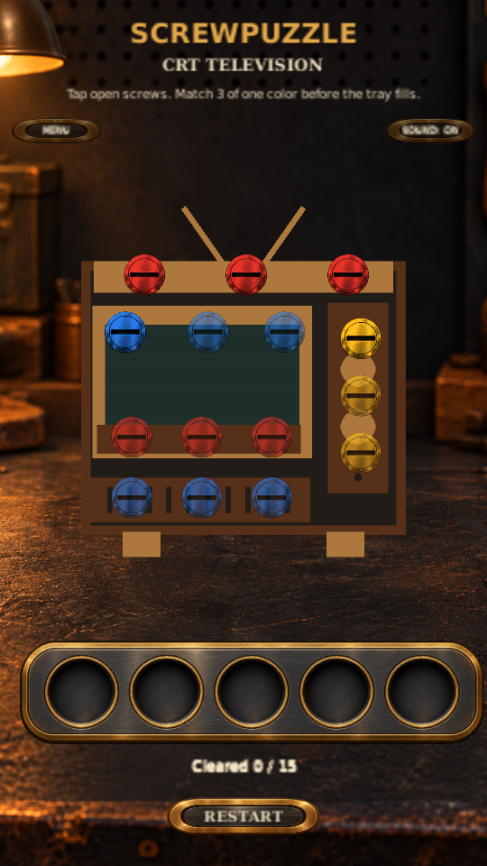
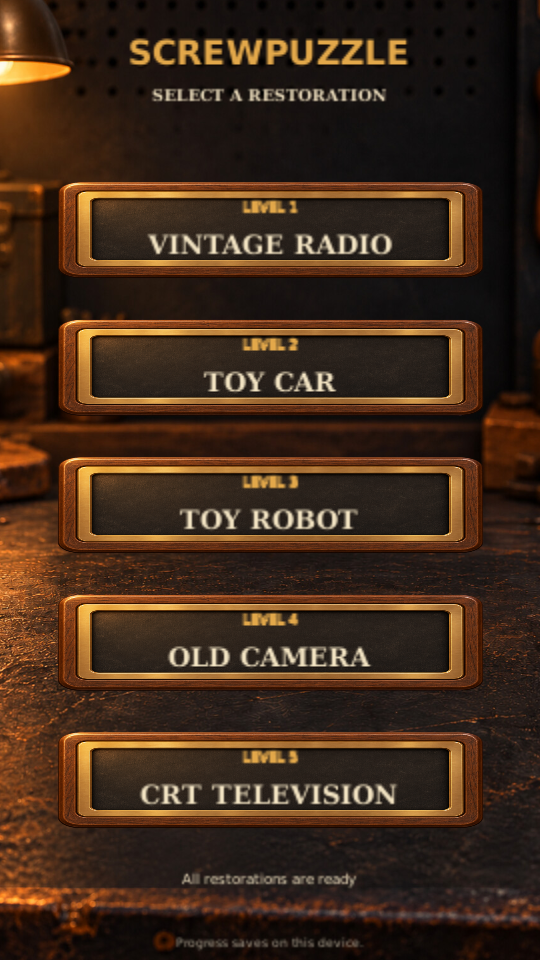
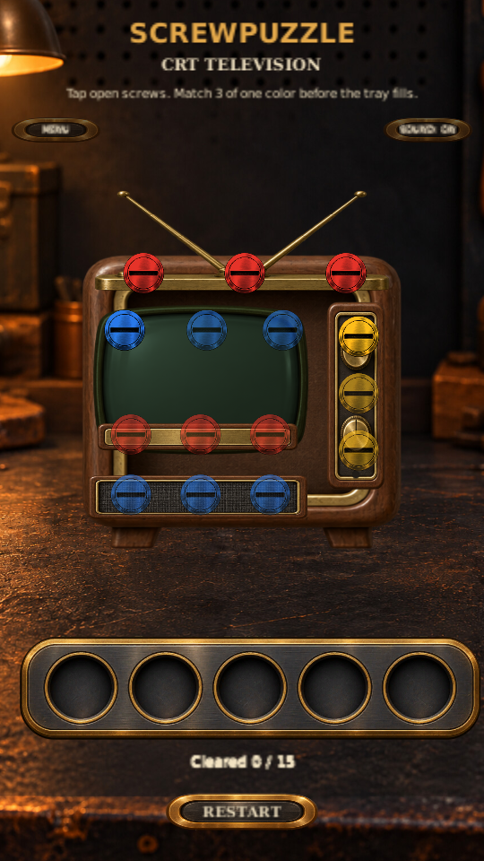

# ScrewPuzzle V0.9 — CRT Television

Status: **Production artwork integrated; final PC/phone regression pending**

## Approved workflow

Build and test the playable Level 5 prototype, validate on PC and Android, then add production
artwork, repeat validation, and commit/push the completed milestone.

## Scope

- Fifteen screws, five tray slots, match-three clearing.
- Five repair stages: antenna rail, screen bezel, control panel, speaker grille, power module.
- Safe route: top red trio; upper blue and right yellow in either order; bottom blue; inner red.
- Restored parts reseat and the CRT screen briefly flickers before settling into a steady glow.
- Old Camera unlocks and opens Television; Television returns to Level Select.
- Five compact level cards, reusing the workshop UI and shared navigation and audio.
- Android version 0.9.0, version code 6.

Production artwork is now integrated. Generated geometry remains as a missing-resource fallback.

## Save compatibility

Existing progress, tutorial completion, and sound preferences are preserved. The save stores only
the highest unlocked level, so it cannot distinguish Camera completed from Camera unlocked.
Complete or replay Camera to unlock Television. Completing Television caps unlocks at Level 5.

## PC and physical Android acceptance checks

Open Assets/Scenes/Level05_CrtTelevision.unity for direct testing.

| Test | Expected result |
|---|---|
| Start Television | CRT TELEVISION title; fifteen screws; no first-play tutorial |
| Tap blocked screws | Blocked feedback, with no screw removed |
| Clear top red, upper blue, right yellow, bottom blue, inner red | Five matches clear and each repair stage responds |
| Swap upper blue and right yellow in the route | Puzzle still completes |
| Select definition indexes 0, 3, 6, 1, 4 | Five mixed screws cause Game Over |
| Restart after loss | All screws and unlit screen reset |
| Complete puzzle | Parts reseat, power lamp lights, screen flickers locally and remains lit |
| View win actions | Exactly one LEVEL SELECT action |
| Use Menu, Resume, Restart, leave confirmation, Android Back | Shared navigation works and menu blocks puzzle input |
| Complete Old Camera | NEXT LEVEL opens Television; Level 5 unlock is saved |
| Relaunch after unlock | Television remains available; no Level 6 |
| Open five-card selector | Every card and label fits portrait screen; locked Television cannot be opened |
| Play all five levels | Tutorial, audio preference, wins/losses, and progression retain expected behavior |

## Automated validation record

September 27, 2026: all fifteen Unity tests passed in an isolated project copy, including the
existing Camera regression and the Television loss → restart → win sequence. Checks cover both
safe routes, intentional loss, scene registration, Camera unlock of Level 5, and progression cap.
The CRT ends with its steady screen glow and restored result. Portrait renders of the CRT and
five-card selector were inspected at 540 × 960.

Tamika subsequently reported all test scenarios passed successfully in response to the PC and
phone test checklist. This validates the prototype phase; production-art regression is separate.

## Production art progress

A six-part walnut-and-brass atlas is integrated: cabinet, antenna rail, CRT screen, controls,
speaker grille, and power trim. The original PNG alpha channel was verified; generated preview
background color data is transparent in the actual sprite. Each part follows its existing repair
assembly and all fifteen screw positions are unchanged. The screen darkens for play and lights
up after repair. Source and prompt: [Television art source](art/Television_ART_SOURCE.md).

## Remaining validation

All fifteen Unity tests passed again with production artwork on September 27, 2026. The runtime
test verifies all six art layers load below the screws and completes loss, restart, victory, and
steady screen activation. A portrait Unity render was inspected for transparency, alignment,
and screw visibility. Final PC/phone validation of this artwork remains pending.

Check that every screw remains comfortably tappable, all five repair assemblies move and
reseat cleanly, the CRT flicker settles into a steady glow, and navigation, audio, restart,
win/loss, and saved progression still work.

Production artwork must be integrated and then pass visual, touch, and gameplay regression on
both platforms. V0.9 is not complete yet.
