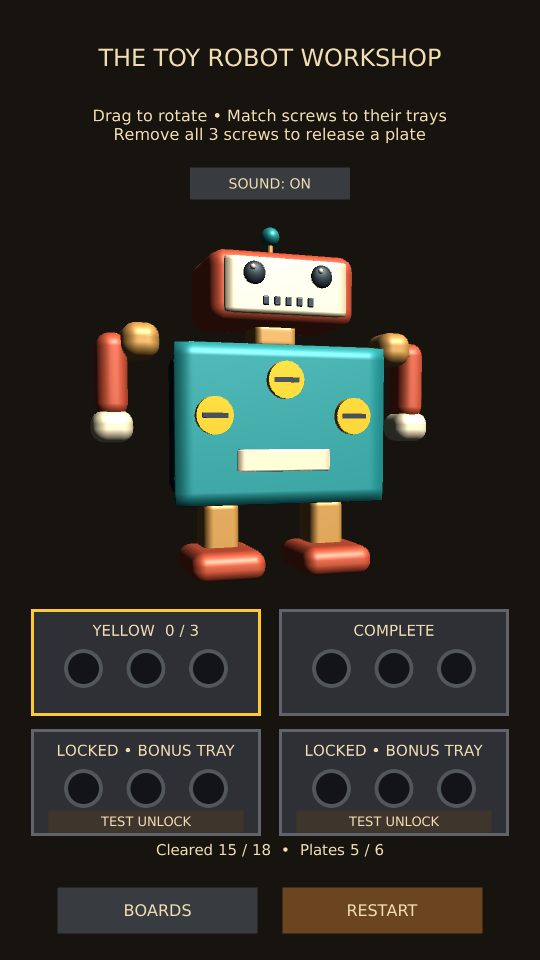

# Workshop puzzle variety

The three toys now introduce different layouts:

| Board | Screws / plates | Layout |
| --- | --- | --- |
| Radio | 15 / 5 | Introductory straight rows and one hidden plate |
| Toy Car | 15 / 5 | Staggered side screws; colors change position across near, far and rear panels |
| Toy Robot | 18 / 6 | Triangular chest patterns and a three-plate stack: coral chest, brass inner plate, teal core cover |

The robot's core has three yellow screws and is locked until the brass plate has
finished releasing. The underlying motor becomes visible after the core cover
falls away. Each deeper layer sits physically behind the previous one. The head,
limbs and original toy identity stay intact.

Each board supplies its tray sequence to the shared puzzle. Radio and Car retain
R/B/Y/R/B; Robot adds a final Y tray. Two free trays remain sufficient. Restart
rebuilds the same queue and restores every covering plate. Completed-board records
are retained; replaying the revised puzzles does not erase prior wins.

## Device checks

- Replay Toy Car: rotate and find the reordered colors; check every screw remains easy to tap.
- Replay Robot using only the two free trays. Confirm the counter starts at 18 screws / 6 plates.
- Remove the chest: only the brass layer's blue screws should be available.
- Remove the brass layer: the teal core's yellow screws should become available.
- The celebration must wait for the core's three screws and its plate release.
- Restart while a deeper plate is moving and after winning. All 18 screws, six plates,
  locked layers, and the tray queue must reset correctly.
- Rebuild the combined Workshop APK and repeat on phone, including switching boards.

User acceptance: the user reported all test scenarios passed successfully after being asked to test the revised Car and Robot on PC and a fresh phone build, including deeper layers and Restart during plate removal.

Validation: nine selected project tests passed across two runs, plus two render helpers. Coverage includes raycast access to every car/robot screw, two-free-tray solves, the robot's core remaining locked through the inner plate animation, no early win, Restart during inner release, completed-board persistence, tutorial and completion navigation. Portrait and wide core-layer renders and refreshed car/robot thumbnails were visually inspected.

