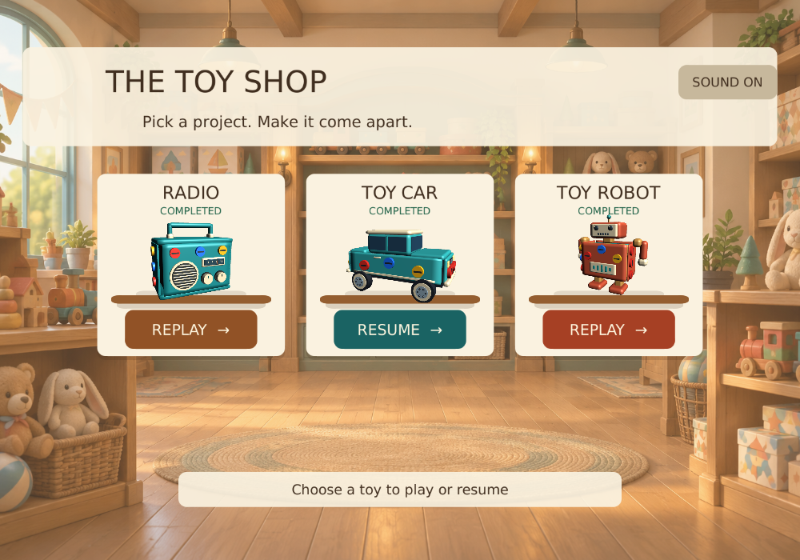

# Resume unfinished workshop puzzles

Each toy now saves its own unfinished run on this device. The Toy Shop button reads
RESUME when a run exists. Completed markers remain visible for toys being replayed.
Selecting a different toy does not discard progress. Next Toy also resumes that toy's
unfinished run when one exists.

Accepted screw selections and test-tray unlocks are flushed to PlayerPrefs immediately.
On reopening, the game restores removed screws, released plates, partial tray contents,
tray assignments, bonus-tray state and the remaining tray queue. An interrupted
animation resumes as a finished move, with no duplicate screws or partially fallen
plates. The model starts at its normal viewing angle. Winning removes the unfinished
run while keeping completion. Restart / Play Again starts a fresh run for that toy.

The save records an ordered list of accepted moves plus a layout signature. Replay
validates each move against the actual puzzle. Invalid, corrupt, or incompatible runs
fall back to a fresh puzzle without removing completed-board records. The records are
local to the device; there is no PC/phone sync. Older versions did not save unfinished
runs, so only moves made after this update can be resumed.

## Device acceptance

1. On each toy, remove a few screws, return to the shop, and check RESUME.
2. Reopen and verify missing screws and partially filled trays. Switch toys and back.
3. Close/reopen the app during screw motion and during a plate release. The accepted
   move should be finished after resuming, and the board should remain solvable.
4. On Robot, save with the brass layer removed and confirm the core is accessible.
5. Open a test bonus tray, leave, and confirm that tray remains open on resume.
6. Restart a resumed board, then leave and return. It should be fresh, with bonus
   trays locked; any earlier COMPLETED marker should remain.
7. Win, return to the shop, and check REPLAY rather than RESUME.
8. Repeat on a fresh Workshop Android build, including fully closing the app.

User acceptance: the user reported testing passed successfully after the requested PC and fresh-phone-build checks for interrupted animations, deeper-layer resume, Restart and Replay.

Validation: all 15 selected workshop tests passed across the initial and follow-up runs, plus a Resume-card render helper. Coverage includes partial tray counts, unlock restoration, board switching during motion, restart across Unity play sessions, deep-layer restore, interrupted final-move completion, corrupt/duplicate-action rollback, and retained completion. Portrait and wide Resume-card layouts were visually inspected. The navigation regression was updated from the superseded fresh-visit expectation. User acceptance was subsequently reported successful.

