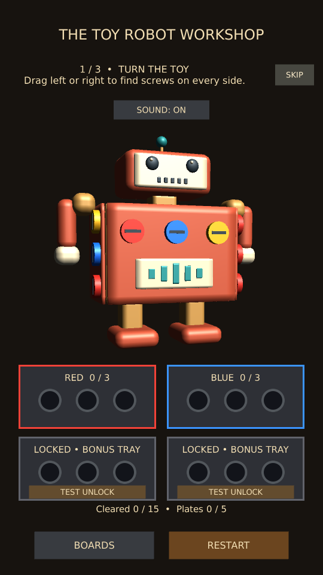

# First-play workshop tutorial

New players see three short prompts above the toy:

1. Drag horizontally to rotate it (20 degrees of pointer-driven rotation).
2. Match screws to an open tray and clear a set of three.
3. Remove the covering plate, then collect an inner screw.

The third prompt changes when the hidden layer becomes accessible. Guidance does
not block gameplay or change screw/tray rules. SKIP is available throughout and
saves dismissal immediately. Finishing also saves immediately; subsequent boards,
replays and app launches show the ordinary instructions. This preference is local
to each device and separate from board completion. An unfinished tutorial starts
again on a fresh board or Restart. Existing installations see it once after updating.
Winning also finishes the tutorial if a player completed actions out of order.

## PC and phone acceptance

- On the first board visit, verify the turn prompt and SKIP fit above the toy.
- Drag to advance, fill a tray, then uncover the inner layer and collect a screw.
- Restart partway through: guidance should reset, and all gameplay should still work.
- After finishing, switch boards and close/reopen the app; guidance should stay dismissed.
- On a device that has not finished it, try SKIP and confirm no screws or completion
  records change. Guidance should remain dismissed after reopening.
- Build a fresh Workshop Android APK for phone review. Phone and PC preferences are separate.

Implementation: WorkshopTutorial observes pointer rotation, cleared trays and inner
screw state. Tests preserve the developer's existing tutorial preference.

Validation: eight selected project tests passed across the initial run and corrected tutorial-test rerun, plus a portrait/wide preview capture. Coverage includes real pointer rotation, tray completion, hidden-screw collection, Restart, skip persistence across boards, and unchanged board-completion records. The skip test snapshots preferences after entering Play mode so both compared values use the same Unity session. Both layouts were visually inspected. User acceptance: the user reported all test scenarios passed after being asked to check guided play on PC, Skip on a fresh phone build, and remembered dismissal after reopening.

